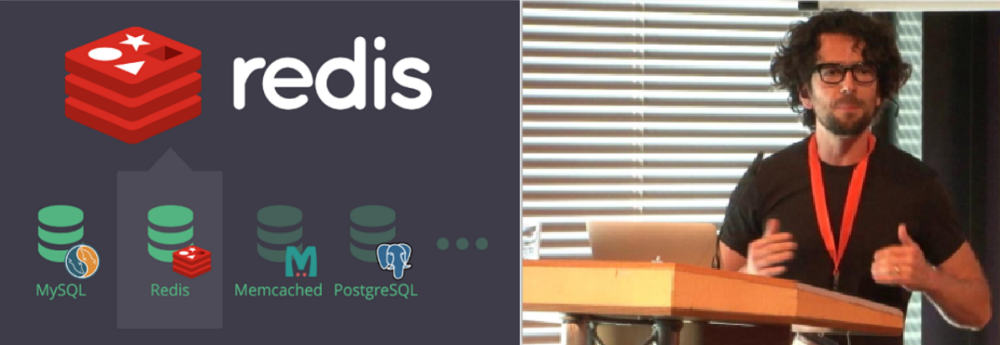

# Redis概述

## 1.RDBMS数据库和NoSQL数据库

数据库主要分为两大类：关系型数据库与 NoSQL 数据库。

1. **关系型数据库**：是建立在关系模型基础上的数据库，其借助于集合代数等数学概念和方法来处理数据库中的数据。主流的 MySQL、Oracle、MS SQL Server 和 DB2 都属于这类传统数据库。

2. **NoSQL数据库**：全称为 Not Only SQL，意思就是适用关系型数据库的时候就使用关系型数据库，不适用的时候也没有必要非使用关系型数据库不可，可以考虑使用更加合适的数据存储。主要分为临时性键值存储（memcached、Redis）、永久性键值存（ROMA、Redis）、面向文档的数据库（MongoDB、CouchDB）、面向列的数据库（Cassandra、HBase），每种 NoSQL 都有其特有的使用

   场景及优点。

3. 由于随着互联网发展，数据量越来越大，对性能要求越来越高，传统数据库存在着先天性的缺陷，即单机（单库）性能瓶颈，并且扩展困难。这样既有单机单库瓶颈，却又扩展困难，自然无法满足日益增长的海量数据存储及其性能要求，所以才会出现了各种不同的 NoSQL 产品，NoSQL 根本性的优势在于在云计算时代，简单、易于大规模分布式扩展，并且读写性能非常高

### 1.1.RDBMS和NOSQL的特点及优缺点

1. **存储方式**：
   - 关系型数据库基于磁盘进行存储，会有大量的磁盘IO，对性能有一定影响；
   - 非关系型数据库，他们的操作更多的是依赖于内存来操作，内存的读写速度会非常快，性能自然会好一些
2. **扩展性扩展性**：
   - 关系型数据库集群模式一般是主从，主从数据一致，起到数据备份的作用，称为垂直扩展。
   - 非关系型数据库可以将数据拆分，存储在不同机器上，可以保存海量数据，解决内存大小有限的问题。称为水平扩展。
   - 关系型数据库因为表之间存在关联关系，如果做水平扩展会给数据查询带来很多麻烦

|      | RDBMS                                                        | NOSQL                                                        |
| ---- | ------------------------------------------------------------ | ------------------------------------------------------------ |
| 特点 | 1. 数据关系模型基于关系模型，结构化存储，完整性约束 2. 基于二维表及其之间的联系，需要连接、并、交、差、除等数据操作 3. 采用结构化的查询语言(SQL)做数据读写 4. 操作需要数据的一致性，需要事务甚至是强一致性 | 1. 非结构化的存储 2. 基于多维关系模型 3. 具有特有的使用场景 |
| 优点 | 1. 保持数据的一致性(事务处理) 2. 可以进行 join 等复杂査询 3. 通用化，技术成熟 | 1. 高并发，大数据下读写能力较强 2. 基本支持分布式，易于扩展，可伸缩 3. 简单，弱结构化存储 |
| 缺点 | 1. 数据读写必须经过 sql 解析，大量数据、高并发下读写性能不足 2. 对数据做读写，或修改数据结构时需要加锁，影响并发操作 3. 无法适应非结构化存储 4. 扩展困难，昂贵、复杂 | 1. join 等复杂操作能力较弱 2. 事务支持较弱，通用性差 3. 无完整约束复杂业务场景支持较差 |

## 2.Redis简介

1. Redis (Remote Dictionary Server)在2009年发布，开发者是意大利的Salvatore Sanfilippo，他本想为自己的公司开发一个用于替换MySQL的产品Redis，但是没有想到他把Redis开源后大受欢迎，短短几年，Redis就有了很大的用户群体，目前国内外使用的公司众多,比如:阿里,百度,新浪微博,知乎网,GitHub,Twitter 等
2. 是完全开源的非关系型数据库，使用ANSIC语言编写遵守BSD协议，是一个基于内存的高性能的Key-Value数据库，redis 提供将内存通过网络远程共享的一种服务，还提供了丰富的数据结构，例如String、Hash、List、Set、SortedSet等等。同时Redis支持事务、持久化、LUA脚本、发布/订阅、缓存淘汰、流技术等多种功能特性提供了主从模式、Redis Sentinel和Redis Cluster集群架构方案。Redis 在高并发、低延迟环境要求比较高的环境使用量非常广泛
3. 与传统数据库关系(mysql)相比，Redis是key-value数据库(NoSQL一种)，mysql是关系数据库，Redis数据操作主要在内存，而mysql主要存储在磁盘。Redis在某一些场景使用中要明显优于mysql，比如计数器、排行榜等方面。通常用于一些特定场景，需要与Mysql一起配合使用两者并不是相互替换和竞争关系，而是共用和配合使用。

### 2.1.Redis特性

1. 单线程，每个命令具备原子性，性能极高，Redis能读的速度是110000次/秒，写的速度是81000次/秒；
2. Redis数据类型丰富，不仅仅之间简单的key-value类型的数据，同事还提供了list，set，zsethash等数据结构的存储；
3. Redis支持数据的持久化，可以将内存中的数据保存到磁盘中，重启时，可以再次加载到内存使用；
4. Redis还支持数据备份与恢复机制，支持主从集群、分片集群。

### 2.2.单线程

Redis 单线程是指 Redis 只使用一个主线程来处理所有客户端的请求。避免了多线程模型中常见的锁竞争、死锁以及上下文切换的开销。

1. **事件驱动机制**：Redis 采用了基于 **I/O 多路复用** 的 **事件驱动模型**。通过 `select`、`poll` 或 `epoll` 等系统调用，Redis 能够高效地处理大量并发请求。在这种机制下，Redis 使用单个线程来监听所有的客户端连接，并通过非阻塞 I/O 和事件循环来处理每个请求。
   - **I/O 多路复用**：Redis 利用 `epoll` 或 `select` 等多路复用技术，在单线程中处理多个客户端连接请求，这使得 Redis 可以在不增加线程的情况下高效处理成千上万的并发请求。
2. **基于内存操作**：是一个内存数据库，所有的数据操作都是在内存中进行的。内存的读写速度相比磁盘要快得多，通常是数量级上的差异。内存中的数据访问可以在纳秒级别完成，而磁盘通常需要毫秒级的访问时间。
   - **高速存取**：Redis 将数据存储在内存中，避免了磁盘 I/O 带来的瓶颈。
   - **基于内存设计**：所有数据结构和操作都针对内存进行优化。
3. **高效的命令执行**：Redis 的命令执行非常高效，很多操作的时间复杂度是常数时间（O(1)）。而对于稍微复杂的操作，比如有序集合的范围查询，Redis 使用了优化的算法和数据结构，如跳表，确保即使在大数据量下操作也能保持高效。
   - **O(1) 操作**：例如对字符串的 `SET`、`GET` 操作，哈希表的 `HGET`、`HSET` 操作，集合的 `SADD` 操作等。
   - **跳表和哈希表**：对于需要排序的有序集合，Redis 使用跳表结构实现高效的范围查询和排序操作。
4. **持久化机制的异步性**：提供了两种持久化方式：RDB（快照）和 AOF（追加日志），这两种持久化方式都是异步进行的，不会阻塞主线程对内存数据的操作，因此不会影响性能。
   - **RDB 快照**：定期保存数据的二进制快照，不会影响实时数据读写性能。
   - **AOF 日志**：以追加的方式记录写操作，并通过异步刷盘确保数据安全，读写性能不受显著影响。

## 3.Redis典型应用场景

1. Session 共享，常见于web集群中的Tomcat或者PHP中多web服务器session共享；
2. 电商网站的月度销量排行榜、社交APP的礼物排行榜、小程序的投票排行榜等等。小说网站对小说进行排名，根据排名，将排名靠前的小说推荐给用户；
3. Reids的队列功能做购买限制。比如到节假日或者推广期间，进行一些活动，对用户购买行为进行限制，限制今天只能购买几次商品或者一段时间内只能购买一次。也比较适合适用。
4. 基于GEO(地理信息定位),实现摇一摇,附近的人,外卖等功能

