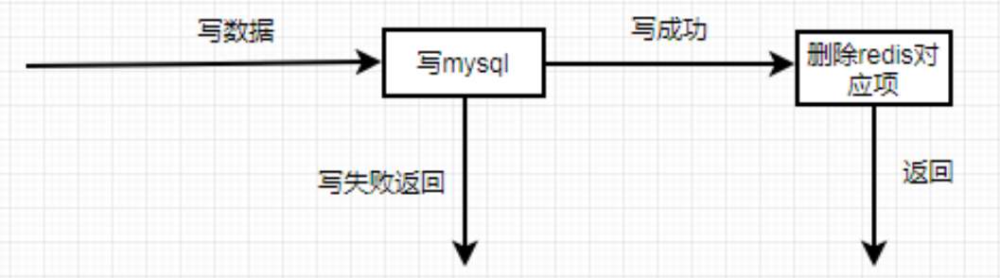
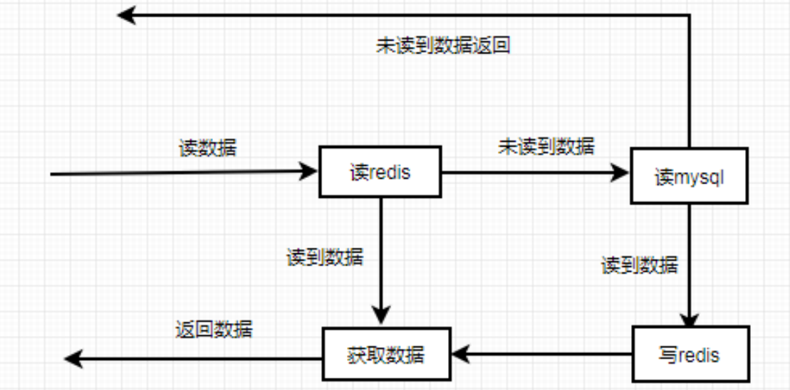

# 缓存的实现流程

## 1.概念

Redis 缓存的概念可以理解为通过将数据存储在内存中，实现流程主要是围绕数据的存取操作进行，快速响应客户端的请求，以减少对后端数据库的访问，通过缓存可以提升系统的性能、降低数据库的负载，提升系统的性能。

## 2.Redis 缓存实现的基本流程

1. **客户端请求数据**： 当客户端需要请求数据时，首先会检查 Redis 缓存中是否存在该数据。如果缓存中存在该数据（即数据已存在 Redis 中），直接从 Redis 返回该数据，避免查询数据库，提高响应速度。如果缓存中没有该数据，执行下一步操作。
2. **查询数据库**： 如果缓存未命中，系统会查询后端数据库（如 MySQL）获取所需的数据。从数据库中获取到数据后，将该数据存入 Redis 缓存中，以备下次请求使用。
3. **返回数据给客户端**： 最后，将从数据库或缓存中获取的数据返回给客户端。

### 2.1.数据更新操作流程

### 2.2.数据读操作流程

## 3.Redis 缓存机制中的常见策略

1. **缓存过期策略**： Redis 支持为每个 key 设置过期时间，避免缓存一直占用内存。可以使用 `EXPIRE` 或 `SETEX` 命令设置过期时间。
2. **缓存淘汰策略**： 当 Redis 内存不足时，会根据配置的淘汰策略清除不常用的数据。常见的淘汰策略包括：
   - **LRU（Least Recently Used）**：最少使用的数据优先淘汰。
   - **LFU（Least Frequently Used）**：最不常被访问的数据优先淘汰。
   - **TTL（Time To Live）**：基于数据的过期时间来淘汰。
3. **缓存一致性**： 在某些场景下，当数据库中的数据发生更新时，需要同时更新缓存，以避免缓存中的数据与数据库不一致。

## 4.Redis 缓存的优势

1. **高性能**：由于 Redis 是基于内存操作的，因此其读写速度非常快，远高于磁盘数据库查询速度。
2. **减少数据库压力**：通过缓存热点数据，减少数据库的查询频率，降低数据库压力。
3. **可扩展性**：Redis 提供了多种持久化和集群模式，便于扩展。

## 5. 典型的 Redis 缓存应用场景

1. **热点数据缓存**：将频繁访问的数据存入 Redis 中，减轻数据库的压力。
2. **会话管理**：在分布式环境中，Redis 可以作为共享的会话存储，以保证多个服务实例间的一致性。
3. **排行榜系统**：Redis 的有序集合（Sorted Set）可以实现像排行榜这样需要按顺序排列的数据结构。

