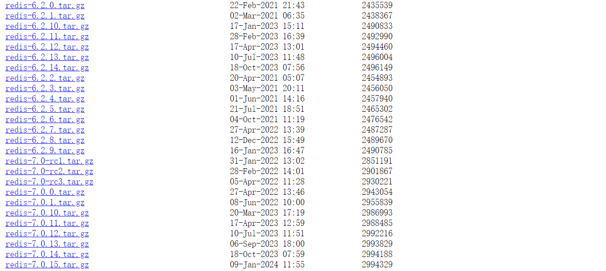
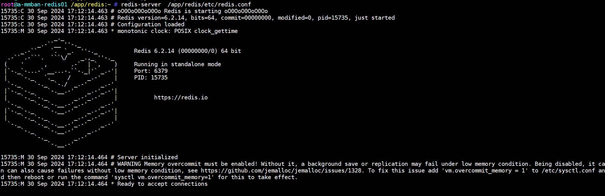
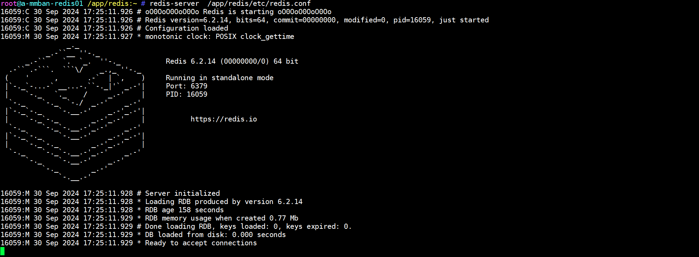

# Redis单节点部署

## 1.前置知识

**Redis 单节点**是 Redis 部署中的最基本形式，即在一台服务器上运行一个 Redis 实例。该实例独立运行，不依赖其他 Redis 节点，处理所有的读写请求。单节点部署是 Redis 的默认部署模式，适用于小型项目或对高可用性和扩展性要求不高的场景。

## 2.下载链接

> :mag:https://redis.io/downloads/
>
> :mag:https://github.com/redis/redis-hashes/
>
> :mag:https://download.redis.io/releases/

## 3.环境检查

### 3.1.安装依赖

~~~shell
## 1.检查系统版本
root@a-mmban-redis01 /root:~ # cat /etc/os-release
root@a-mmban-redis01 /root:~ # uname -a

## Redis 依赖 GCC 和 make 工具来编译源代码，以及一些基础库。
## 2.Ubuntu发行版本
root@a-mmban-redis01 /root:~ # apt update
root@a-mmban-redis01 /root:~ # apt install -y build-essential tcl

## 3.rhel发行版本
sudo yum groupinstall "Development Tools"
sudo yum install tcl
~~~

### 3.2.目录权限

| 文件系统   | 备注         | 格式化类型 | 容量 | 所属用户      | 所属用户组    | 权限 |
| ---------- | ------------ | ---------- | ---- | ------------- | ------------- | ---- |
| /appbackup | 备份目录     | XFS        | 50G  | redis（2468） | redis（2468） | 755  |
| /app       | 应用程序目录 | XFS        | 200G | redis（2468） | redis（2468） | 755  |

~~~shell
## 1.创建用户和组
root@a-mmban-redis01 /root:~ # groupadd -g 2468 redis
root@a-mmban-redis01 /root:~ # useradd -u 2468 -g2468 redis
root@a-mmban-redis01 /root:~ # id redis 
uid=2468(redis) gid=2468(redis) groups=2468(redis)

## 2.创建目录
root@a-mmban-redis01 /root:~ # mkdir -pv /app /appbackup
mkdir: created directory '/app'
mkdir: created directory '/appbackup'

## 3.创建文件系统
root@a-mmban-redis01 /root:~ # vgcreate  datavg /dev/sdb /dev/sdc
root@a-mmban-redis01 /root:~ # lvcreate  -L 200G -n lv_app datavg 
root@a-mmban-redis01 /root:~ # mkfs.xfs /dev/datavg/lv_appbackup

## 4.挂载忽略
.......

## 5.授权
root@a-mmban-redis01 /app/redis:~ # chown -R redis:redis /app/redis/ 
~~~

### 3.3.系统优化

#### 3.3.1.内核参数优化

~~~shelll

~~~

#### 3.3.2.文件系统描述符

~~~shell
~~~

## 4.部署Redis

~~~shell
## 1.解压Redis源码
root@a-mmban-redis01 /opt:~ # tar xvf redis-6.2.14.tar.gz 
root@a-mmban-redis01 /opt:~ # cd redis-6.2.14/

## 2.编译安装
## 将 Redis 的源代码编译成可执行文件。
root@a-mmban-redis01 /opt/redis-6.2.14:~ # make 

## 测试套件
root@a-mmban-redis01 /opt/redis-6.2.14:~ # make test

## 指定redis安装目录
root@a-mmban-redis01 /opt/redis-6.2.14:~ # make PREFIX=/app/redis install

## 准备相关目录和配置文件
## 创建配置文件、日志、数据等目录
root@a-mmban-redis01 /opt/redis-6.2.14:~ # mkdir /app/redis/{etc,log,data,run} 
root@a-mmban-redis01 /opt/redis-6.2.14:~ # cp  redis.conf /app/redis/etc/

## 目录结构
root@a-mmban-redis01 /opt/redis-6.2.14:~ # cd /app/redis/
root@a-mmban-redis01 /app/redis:~ # tree
~~~

### 4.1.配置Redis环境变量

~~~shell
root@a-mmban-redis01 /app/redis:~ # cat /etc/profile.d/redis.sh
REDIS_HOME=/app/redis
PATH=$PATH:$REDIS_HOME/bin
root@a-mmban-redis01 /app/redis:~ # . /etc/profile.d/redis.sh 
root@a-mmban-redis01 /app/redis:~ # redis-
redis-benchmark  redis-check-aof  redis-check-rdb  redis-cli        redis-sentinel   redis-server  
~~~

## 5.Redis配置文件

## 6.启动Redis服务

### 6.1.前台启动

~~~shell
root@a-mmban-redis01 /app/redis:~ # redis-server  /app/redis/etc/redis.conf 
~~~

>:bell:解决启动时肯出现的三个警告提示
>
>1. 第一个警告：只需要将net.core.somaxconn的数值改城大于等于511就可以，backlog参数控制的是三次握手的时候server端收到client ack确认号之后的队列值。
>2. 第二个警告：只需把vm.overcommit_memory 设置城 1就可以。
>3. 第三个警告：大页内存动态分配，需要关闭让redis 负责内存管理。

~~~shell
## 1
将net.core.somaxconn = 511添加到/etc/sysctl.conf中，然后执行sysctl -p生效配置。

## 2
将vm.overcommit_memory = 1添加到/etc/sysctl.conf中，然后执行sysctl -p生效配置。

## 3
将echo never > /sys/kernel/mm/transparent_hugepage/enabled添加到/etc/rc.local中，然后执行source /etc/rc.local生效配置。

## 再次启动redis
root@a-mmban-redis01 /app/redis:~ #  redis-server  /app/redis/etc/redis.conf
~~~

### 6.2.systemd启动配置

~~~shell
root@a-mmban-redis01 /app/redis:~ # cat > /etc/systemd/system/redis.service << EOF
[Unit]
Description=Redis In-Memory Data Store
After=network.target

[Service]
User=redis
Group=redis
ExecStart=/app/redis/bin/redis-server /app/redis/etc/redis.conf 
ExecStop=/app/redis/bin/redis-cli shutdown
Restart=always

[Install]
WantedBy=multi-user.target
EOF

#####
---------------------------------------------
root@a-mmban-redis01 /app/redis:~ # systemctl daemon-reload 
root@a-mmban-redis01 /app/redis:~ # systemctl enable --now redis.service
root@a-mmban-redis01 /app/redis:~ # systemctl status redis.service

## 1.验证服务启停
root@a-mmban-redis01 /app/redis:~ # systemctl stop redis.service
root@a-mmban-redis01 /app/redis:~ # systemctl restart redis.service 
root@a-mmban-redis01 /app/redis:~ # systemctl status redis.service
~~~

## 7.验证

~~~shell
root@a-mmban-redis01 /app/redis:~ # redis-cli  
127.0.0.1:6379> ping
PONG
127.0.0.1:6379> set name kubecy
OK
127.0.0.1:6379> get name
"kubecy"
127.0.0.1:6379> 
~~~

